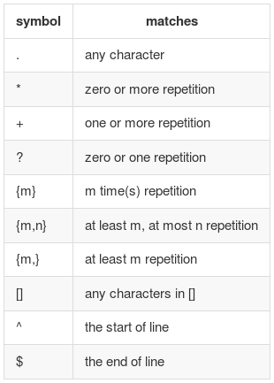



### What is Regular Expression and Why? 
Regular Expression(Regex for simplicity) is a sequence of characters that forms a search pattern, mainly for use in pattern matching with string, or string matching.

There is a very famous quote about regex by [Jamie Zawinski](http://www.jwz.org/):
> Some people, when confronted with a problem, 
> think “I know, I'll use regular expressions.”
> Now they have two problems.

The quote shows two main features of regex: powerful but difficult. When faced with tricked or unbelievable hard problems, regex is always a way. When you decide to use regex, itself becomes a problem due to its difficult to code, understand and maintain.

So, before moving to regex, make sure there is no other easy way to tackle your problem. 

### Conventions
Before further introduction, we need to make some conventions here. Because many programming language(like perl, python, ruby, perl...) have built-in regex, and the definition and usage diff from each other in some detail. Content below doesn't specify any language, only concerns simple and mutal regex knowledge.

First some definitions and conventions:
<dl>
<dt>character</dt>
<dd>Any printable element in ASCII table.</dd>

<dt>metacharacter</dt>
<dd>The character that has special meaning in regex, like .,*,?,^,$</dd>

<dt>(target)? string</dt>
<dd>The string used for regex to match certain spattern</dd>

<dt>regex</dt>
<dd>The special code block used to match pattern in a string</dd>

<dt>match</dt>
<dd>The real match between <strong>string</strong> and <strong>regex</strong> is denoted by =~, as used in ruby.</dd>
</dl>

### Basic Matching
Regex only does one thing: match a given string, return matched position if matched successufully or nil otherwise. If there are more than one matching reuslt, it only returns the first one.

	"Hello, world" =~ /or/			#=> 
	"Hello, world" =~ /le/   		#=> nil
	"Hello, world" =~ /l/			#=> 1

So, the can't be simpler usage of regex is basic "find" function every text editor have in their menu: You type in anything, 
it tells you if what you want exists in the target string. For example, if you want to find someone's name like "Obama":

"Did you vote for Obama?"   =~ /Obama/  #=> true
"Did you vote for Obama?"   =~ /obama/  #=> false

### More flexible
You might see the problem here. Only by typing the exact string, can you get the correct result. What if I don't care about the case of 
all letters? What if I allow some mispelling like "Obema"? What if I want to find "Obama" or "Michelle"? etc.
Where there is a probelm, there is a way. The hero here is '[]'(square bracket) and '|'. '[]' matches anything in it, while '|' repersents logic
OR.

"Did you vote for Obama?"   =~ /[oO]b[ae]ma/#=> true
"Michelle Obama is quite awesome!"  =~ /Miachelle | Barack/ #=> true

Note:
* __One '[]' only matches one character in it.__
* __'|' selects string before or after it, not character, which means /ab|cd/ doesn't match 'abd', only matches 'ab' or 'cd'__

Now you may wonder: what if there are many options for a situation, like match a digit or a letter? Of course you can write down 
all of them in a pair of '[]': [abcdefghijklmnopqrstuvwxyz] or [0123456789]. Write these down for once may still be okay, but frequently using them 
is a nightmare. '[]' solves it before you know, the powerful '-' sign. [a-z] matches anything from 'a' to 'z' and [0-matches from 'to '9'.

Note:  
* __'-' works in the ASCII table way,so [+-a] is also valid.__
* __If you want to include '-' itself in '[]', just put it at the last position like [abc-].__ 

Is that enough? Of course NO! To match a phone number, we need to find a convenient way to repeat digit for certain times(depends on the length of phone number).
As always, there is already a solution. Following examples will demonstrate what you need.
ps: _In order to better illustrate and understand regex, we put emphisis on the matching part in place of mathcing position_  

	"Hello, world" =~ /wo/								#=> Hello, <wo>rld
	"Hello, world" =~ /.l/								#=> H<el>lo, world
	"I'll use regular expressions." =~ /re.*/			#=> I'll use <regular expressions.>
	"Think different!" =~ /if*/							#=> Think d<iff>erent!
	"stay hungry stay foolish" =~ / s[tl]ay/			#=> stay hungry <stay> foolish 
	"stay hungry stay foolish" =~ /^st[aeiou]y/			#=> <stay> hungry stay foolish
	"speak aloud!"  =~ /al[aeiou]{2}d/  #=> speak <aloud>!
	"SHOUT Ahhhhoo!" =~ /Ah{3,5}oo/ #=> SHOUT <Ahhhhoo>!
	

The follow table shows metacharacters and their meaning.

| symbol	| matches  |
|-----------|----------------------------------|
| .	| any character|
| *	| zero or more repetition  | 
| + | one or more repetition   | 
| ?	| zero or one repetition   |
| {m}   | m time(s) repetition |
| {m,n}	| at least m, at most n repetition |
| {m,}  | at least m repetition|
| []	| any characters in [] |
| ^ | the start of line|
| $ | the end of line  |

Symbols in above table are called "metacharacters"  as mentioned before. They have have different
"super power"s compared to normal characters. Here is a question: what if I just want to use the symbol itself
instead of its special meaning? Don't worry, you can escape them with a backslash '\'. '\' has a super power to 
disable others' "super power" including itself.(It must be hard living with such 'useless' super power.)
That means /\\/ matches one '\' sign.

Another thing to say about '[]' is it also disables abbove metacharacters' "super power"s. 
[*+?] matches '*' or '+' or '?'. 
 

###  More powerful
* grouping
'?','*' and '+'only work on character right before them, and '|' selects from string before and after it.
* shortcuts
* variables
	What is you want to use the matched string? The best way is to assign it to certain variables.Fortunately, you don't have to do it by yourself, many languages have built-in variables for this.  
	

### Interesting tricks
* __one-line regex__
	- [/ -~/](http://www.catonmat.net/blog/my-favorite-regex/)  matches all ASCII characters from the space to the tilde which are all printable characters!
	- [/\^1?$|\^(11+?)\1+$/wrong?](http://coolshell.cn/articles/2704.html)magically matches all prime numbers.
* __regex in practice__
  
		email   =>		/\b[A-Z0-9._%-]+@[A-Z0-9.-]+\.[A-Z]{2,4}\b/
		ip		=>		/^(([0-9]|[1-9][0-9]|1[0-9]{2}|2[0-4][0-9]|25[0-5])\.){3}([0-9]|[1-9][0-9]|1[0-9]{2}|2[0-4][0-9]|25[0-5])$/
